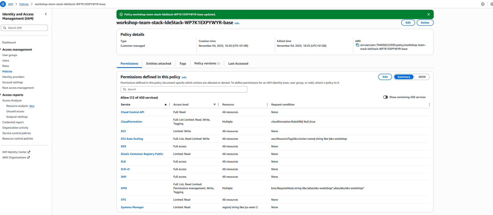

# Summary of Changes and additions to NGINX Gateway Fabric Lab on EKS Workshop

## Author
Javier Garcia Garcia - Cloud Operations Architect at AWS

## Preparing the EKS cluster for labs

### 1 Check cluster is operative and you can work with it
```
$> kubectl get nodes

NAME                                          STATUS   ROLES    AGE   VERSION
ip-10-42-118-46.us-west-2.compute.internal    Ready    <none>   65m   v1.33.0-eks-802817d
ip-10-42-142-64.us-west-2.compute.internal    Ready    <none>   65m   v1.33.0-eks-802817d
ip-10-42-181-164.us-west-2.compute.internal   Ready    <none>   65m   v1.33.0-eks-802817d
```

### 2 Check your AWS credentials to get to know your current working role
```
$> aws sts get-caller-identity

{
    "UserId": "ARXXXXXXXXXFDY:i-0XXXXXXXXXXXXXXa",
    "Account": "79XXXXXXXX95",
    "Arn": "arn:aws:sts::79XXXXXXXX955:assumed-role/workshop-team-stack-IdeStack-WP7-EksWorkshopIdeRole-Unbs0xa4Lnl0/i-0d99098a70b31122a"
}
```
As we can see the role that we are using to access AWS is `workshop-team-stack-IdeStack-WP7-EksWorkshopIdeRole-Unbs0xa4Lnl0`. We will have to change the perms to allow it to deploy LoadBalancers on our behalf when deploying certain Kubernetes resources

### 3 Apply permissions

3.1. Access the console using the link in the workshop page
3.2. Access IAM roles
3.3. Search for your role (like `workshop-team-stack-IdeStack-WP7-EksWorkshopIdeRole-Unbs0xa4Lnl0` in step 2 above)


3.4. Select policy `workshop-team-stack-IdeStack-XXXXXXXX-base`: the policy will be edited as the there's a maximum limit of 10

3.5 Click `Edit`

3.6 In the right pane, JSON view, type `ELB v2` in the `choose a service` search field. Select all actions (`ELB Full Access`).
3.7 Type `IAM` in the `choose a service` search field and select all actions (`ELB Full Access`)
3.8 Click `Next` and save all changes
3.9 The role is now associated to these policies:



### 4 Install AWS Load Balancer Controller

4.1 Download the necessary policy that will be applied to the AWS Load Balancer controller
```
$> curl -O https://raw.githubusercontent.com/kubernetes-sigs/aws-load-balancer-controller/v2.14.1/docs/install/iam_policy.json
```

4.2 Apply the policy
```
$> aws iam create-policy \
    --policy-name AWSLoadBalancerControllerIAMPolicy \
    --policy-document file://iam_policy.json

{
    "Policy": {
        "PolicyName": "AWSLoadBalancerControllerIAMPolicy",
        "PolicyId": "ANPAVRUVVY3PGGES4Y46U",
        "Arn": "arn:aws:iam::381492250334:policy/AWSLoadBalancerControllerIAMPolicy",
        "Path": "/",
        "DefaultVersionId": "v1",
        "AttachmentCount": 0,
        "PermissionsBoundaryUsageCount": 0,
        "IsAttachable": true,
        "CreateDate": "2025-11-04T22:03:20+00:00",
        "UpdateDate": "2025-11-04T22:03:20+00:00"
    }
}
```

4.3 Create the service account to link the policy to the AWS Load Balancer Controller

**Note:** `CLUSTER`, `ACCOUNT_ID` and `REGION` may vary. Check the console to get all correct values.
```
$> eksctl create iamserviceaccount \
    --cluster=eks-workshop \
    --namespace=kube-system \
    --name=aws-load-balancer-controller \
    --attach-policy-arn=arn:aws:iam::<ACCOUNT_ID>:policy/AWSLoadBalancerControllerIAMPolicy \
    --override-existing-serviceaccounts \
    --region us-west-2 \
    --approve
```

4.4 Add the `eks-charts` Helm chart repository. AWS maintains this [repository on GitHub](https://aws.github.io/eks-charts).
```
$> helm repo add eks https://aws.github.io/eks-charts
```

4.5 Update your local repository to make sure the most recent charts are used.
```
$> helm repo update eks
```

4.6 Deploy the AWS Load Balancer Controller.
```
$> helm install aws-load-balancer-controller eks/aws-load-balancer-controller \
  -n kube-system \
  --set clusterName=my-eks-workshop \
  --set serviceAccount.create=false \
  --set serviceAccount.name=aws-load-balancer-controller \
  --version 1.14.0
```

4.7 Verify the AWS Load Balancer Controller has been correctly deployed

```
$> kubectl get deployment -n kube-system aws-load-balancer-controller

NAME                           READY   UP-TO-DATE   AVAILABLE   AGE
aws-load-balancer-controller   2/2     2            2           6m58s
```

Configuration is now complete.

### FAQs

Answers by Amazon Q developer extension (you can use it for free!)

####  Do I still require AWS Load Balancer Controller when using NGINX Gateway Fabric?

Yes, exactly! Even though you're using NGINX Gateway Fabric, you still need the AWS Load Balancer Controller when running on EKS.

NGINX Gateway Fabric and AWS Load Balancer Controller perform different roles:

* NGINX Gateway Fabric: Handles application-layer routing, Gateway API implementation, and traffic management inside your cluster
 * AWS Load Balancer Controller: Provisions the actual AWS infrastructure (NLB/ALB) that exposes your services to the outside world

Lacking AWS Load Balancer Controller, `NodePort` deployment for NGINX Gateway Fabric is required
